# Current State & Storytelling Animation Suggestions

**Project:** SGC Tech AI — UAE Practitioner-Led Odoo + AI  
**Branch:** `wip/pre-ecc-checkpoint`  
**Captured:** 2026-06-08  
**Purpose:** Document every implemented section with its current animation state and a concrete suggestion for deepening the storytelling through motion.

---

## How to read this document

Each section entry has three parts:

| Label | Meaning |
|---|---|
| **Screenshot** | Viewport capture at section entry point |
| **Current** | What animation / motion is already live |
| **Suggestion** | A specific storytelling animation to add next |

Animation tool split (per CLAUDE.md): scroll-scrubbed work → GSAP ScrollTrigger · component micro-interactions → Motion (`motion/react`) · 3D per-frame → R3F `useFrame`.

---

## 1. Navbar + CredentialRow

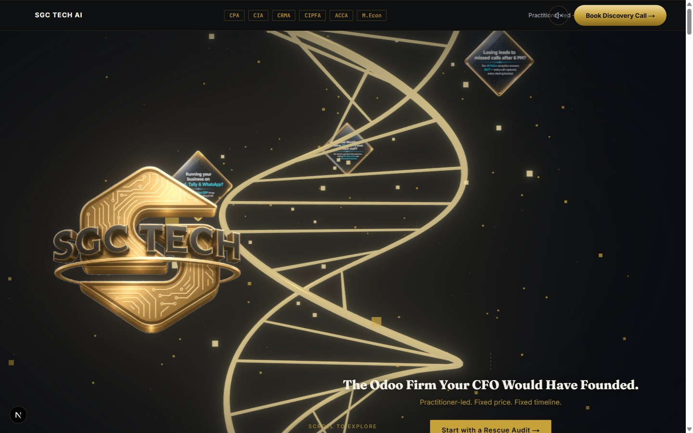

### Current
- Sticky navbar: instant paint on load, no entrance animation.
- CredentialRow: static credential badges (CPA, CIA, Odoo Partner, etc.) — no animation.
- Gold hairline draws left-to-right on nav link hover via `<GoldHairline>`.

### Suggestion — Trust cascade on load
Stagger the credential badges in from below with a 40ms delay between each: opacity 0→1 + translateY 8px→0, ease-out-quart, 420ms each. The sequence should read left-to-right like a résumé being handed over. This is the first authority claim the page makes — it should feel deliberate, not instant.

```
Tool: motion/react — whileInView stagger, once:true, amount:0.8
staggerChildren: 0.04, y: 8→0, opacity: 0→1
```

---

## 2. DiamondScrollHero — Entry (Above Fold)


### Current
- `HeroIntroOverlay` plays a cinematic intro sequence on first load (brand name, credentials, tagline).
- R3F canvas: helix DNA strand, 8 diamonds, particle field.
- Camera moves along Y/Z via GSAP ScrollTrigger reading `scrollProgressRef`.
- `RotatingSpine` applies 0.08 rad/s baseline Y rotation to the helix.
- `HeroTextOverlays`: headline and sub-headline fade in after intro completes.

### Suggestion — Pre-scroll camera breath
Before the user scrolls, add a slow 6s Y-bob on the camera (`sin(t × 0.4) × 0.06` world units) via `useFrame` — a breathing idle that signals "this is alive." Cease the bob the moment scroll > 5px (check `scrollProgressRef.current < 0.005`). This makes the 3D scene feel inhabited rather than frozen while the user reads the hero copy.

```
Tool: R3F useFrame — lerp camera.position.y toward sin(clock.elapsedTime * 0.4) * 0.06
      Disable when scrollProgressRef.current > 0.005
```

---

## 3. DiamondScrollHero — Mid Scroll (Diamond Captions)

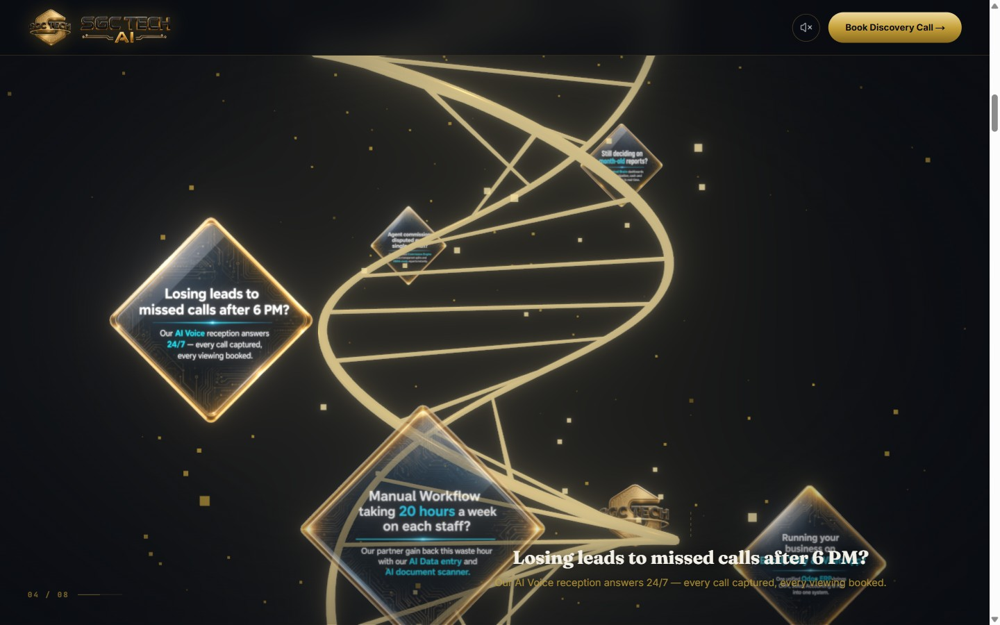

### Current
- Each of 8 diamonds activates when `activeIndex` changes.
- `CinematicCaption` fades caption text in/out via Motion `AnimatePresence`.
- Active diamond glows, scales, and emits a radial pulse (lerped `diamondActiveness`).
- Connection lines between diamonds draw in via SVG stroke-dashoffset.

### Suggestion — Caption word-by-word reveal
Instead of the full caption fading in as a block, split the headline into words and stagger each: opacity 0→1 + translateY 6→0 at 35ms per word. This mimics how a speaker would deliver the line — creating a rhythm that holds attention. Keep the exit as a full-block fade (simple, fast).

```
Tool: motion/react — split headline by word, staggerChildren: 0.035
      Exit: whole div opacity 0, duration 0.2
```

---

## 4. Problem Section

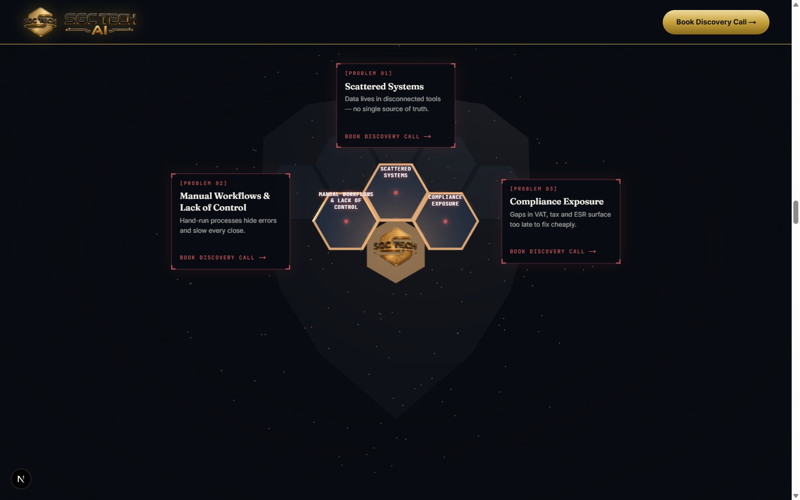

### Current
- `RevealOnScroll` on heading and intro paragraph (opacity + translateY, `once: true`).
- `GoldDrawIn` — 1px gold line draws in from left as section enters viewport.
- `LivingCard` on each of 3 problem cards (subtle hover depth effect).
- `ScrollParallax` on background radial gradient (20px Y amplitude).
- Cost line items (AED 48K, AED 90K, AED 36K, AED 30K) render statically.

### Suggestion — Cost counter roll-up
Animate each cost figure counting up from 0 to its value over 1.2s (easeOut), triggered when the cost grid enters the viewport. The "Total Hidden Cost" sum should land 400ms after the last item settles. Seeing numbers accumulate makes the pain visceral and quantified — the visitor feels the cost, not just reads it.

```
Tool: motion/react — useMotionValue + spring, or requestAnimationFrame counter
      Trigger: IntersectionObserver once, amount: 0.6
      Total sum: delay 0.4s after last item
```

---

## 5. Shield Section — Early (Tiles 0–2 assembling)

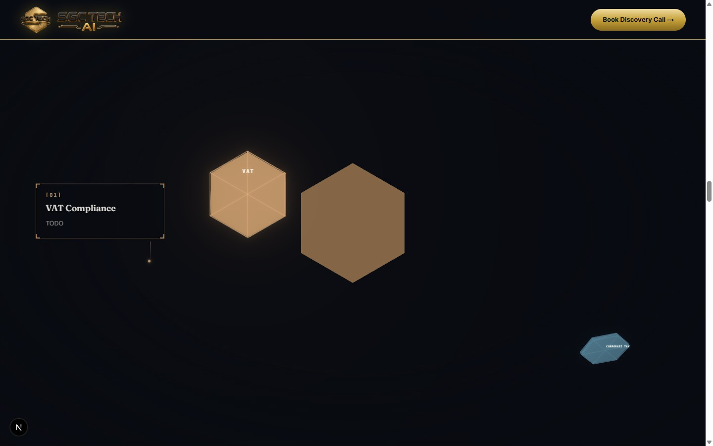

### Current
- 750vh pinned scroll container.
- Six hex tiles fly in from cluster origin → lock to `TILE_LOCK_POS` one-by-one.
- Each tile: opacity/scale ramp during approach, snap to locked position.
- `TrackingCallout` draws a gold SVG connector line + glass card per tile after lock.
- Pulsing dot at hex center while callout is active.

### Suggestion — Tile lock "click" micro-shake
When each hex tile reaches its locked position, apply a single-frame displacement: nudge 3px toward center then snap back over 120ms (spring, no bounce). This gives the assembly physical weight — like tiles being placed by a precise hand. It rewards scroll attention with a satisfying tactile moment.

```
Tool: R3F useFrame — on the frame tile state transitions to LOCKED,
      spike localPosition toward origin × 0.04, release over 8 frames via lerp
```

---

## 6. Shield Section — Mid (Tiles 3–5, frame + filler visible)

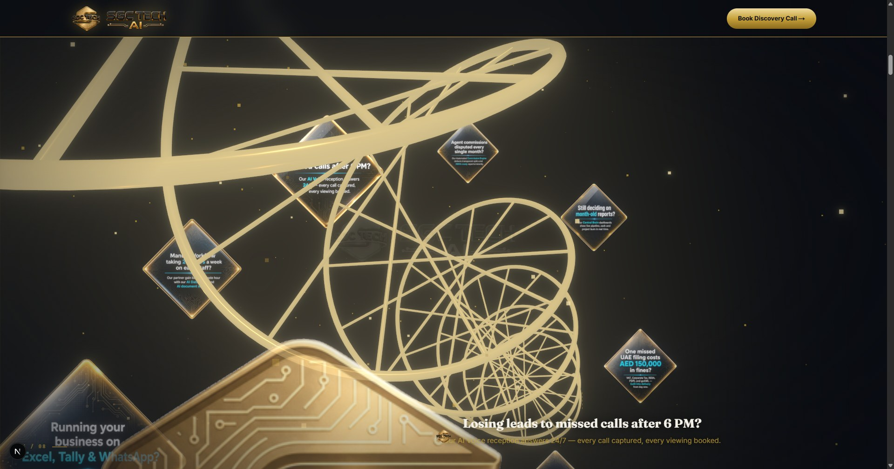

### Current
- Shield frame (gold CatmullRom tube) is present but fades in at a defined scroll window.
- Final 3 hex tiles lock progressively.
- Connector line SVG draw-in (strokeDashoffset, hex center → card edge).
- `FillerMesh` honeycomb interior fades in as tiles complete.

### Suggestion — Progressive shield frame glow intensify
As each tile locks (tiles 0→5), increase the ShieldFrame tube's emissive intensity: start 0.3, add +0.12 per locked tile, reach 1.0 when all 6 are in. The frame literally brightens as protection becomes complete — a visual charge-up that mirrors the narrative of "nothing slips through."

```
Tool: R3F useFrame — derive lockedCount from scroll progress windows,
      lerp shieldFrameMaterial.emissiveIntensity toward (0.3 + lockedCount * 0.12)
```

---

## 7. Shield Section — Finale ("Nothing slips through")

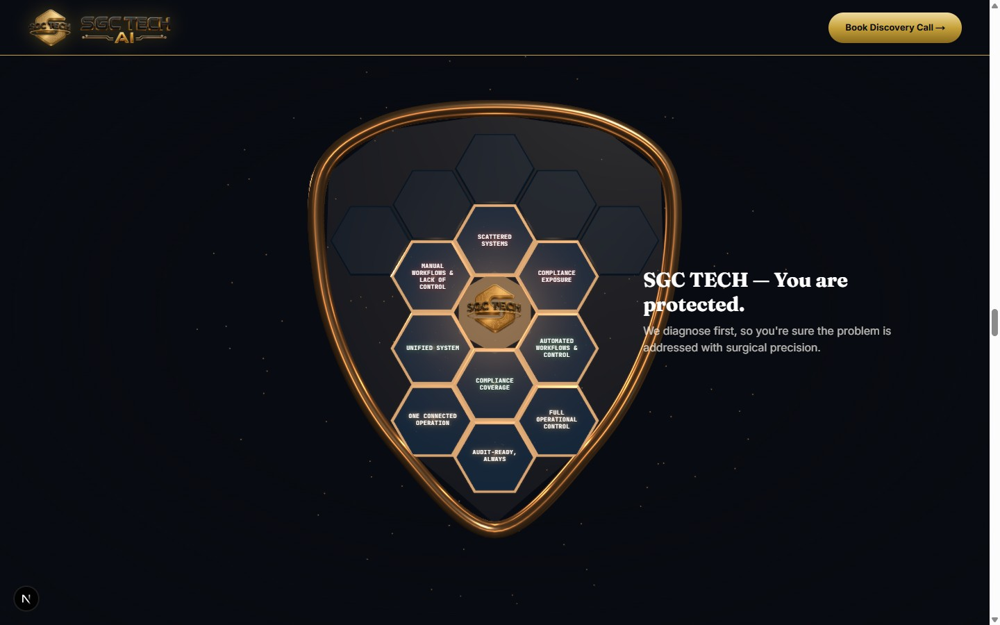

### Current
- Shield + cluster group glides right via CSS `translateX(10%)` on desktop.
- Background video fades in (opacity 0→0.18) replacing the solid dark background.
- `FinaleTitle`: headline types character-by-character at 55ms/char.
- Subtitle paragraph fades up after typewriter completes.
- `FinaleGlow` gold pulse radiates behind the shield.

### Suggestion — Callout cards converge into the shield
Currently the callout cards simply fade out during the finale. Instead, animate each card translating toward the shield center (converging inward, staggered 60ms apart) while scaling to 0.05 and fading — as if the shield has absorbed the six compliance pillars. Then `ShieldSummaryCallout` rises from below. This creates a "gathering into one" beat: six problems → one shield.

```
Tool: motion/react — AnimatePresence exit for each callout:
      x toward shield_cx, y toward shield_cy, scale: 0.05, opacity: 0
      duration: 0.4, stagger: 0.06, triggered at scroll window [0.88–0.94]
```

---

## 8. Solution Section

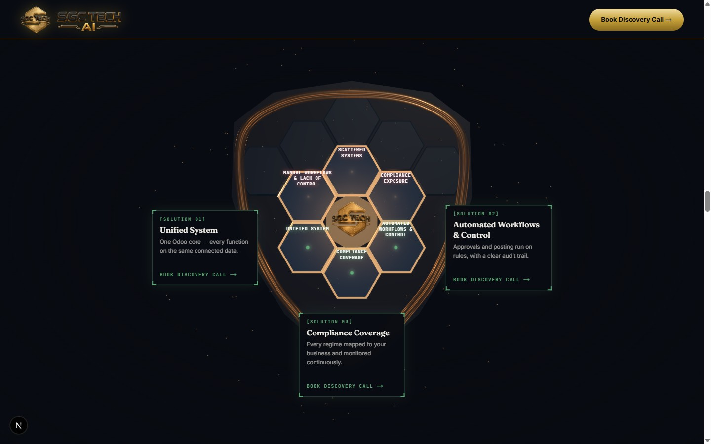

### Current
- `RevealOnScroll` on heading and intro paragraph.
- `GoldDrawIn` top accent.
- Three outcome pillars (Financial Visibility, Compliance Assurance, Operational Reclaim) as `LivingCard`.
- Stack diagram (5 layers: AI → Odoo Core → Integration → Infrastructure) renders statically.
- `ScrollParallax` on background gradient.

### Suggestion — Stack diagram builds layer by layer
The five stack layers should build upward from Infrastructure → AI Layer as the section scrolls: each layer slides up from the one below (translateY 24→0, opacity 0→1) with a 120ms stagger. Foundations first, intelligence on top — the visual metaphor mirrors what SGC actually builds for clients.

```
Tool: motion/react — staggerChildren: 0.12, direction bottom-to-top (reverse render order)
      whileInView, once:true, amount: 0.3
```

---

## 9. Case Study Section

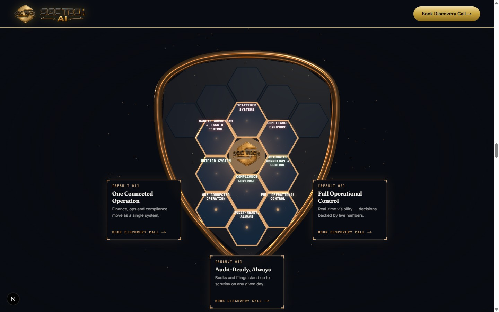

### Current
- `RevealOnScroll` on heading block.
- Case study cards / results with static layout.
- `GoldDrawIn` top accent.

### Suggestion — Result numbers count up on entry
Numerical outcomes (days saved, AED figures, percentage improvements) should count up from 0 as the section enters. Use a faster ease-in-out (400ms) than the problem section — here the numbers tell a success story, so they should land with confidence. A gold SVG checkmark draws in via stroke-dashoffset (150ms) after each number settles.

```
Tool: motion/react — useMotionValue + spring per metric
      SVG checkmark: strokeDashoffset 100→0, triggered 400ms after number lands
```

---

## 10. Founder Section

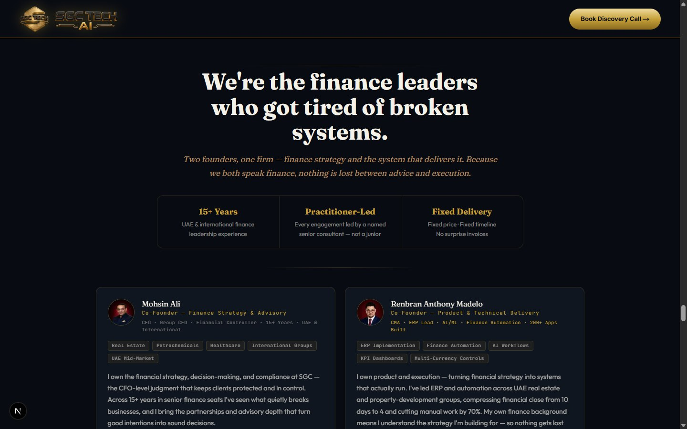

### Current
- Founder bio text with `RevealOnScroll`.
- Photo renders statically.
- Credential badges listed beneath bio.
- `GoldDrawIn` accent.

### Suggestion — Photo clip reveal + credential cascade
The founder photo enters with a vertical clipPath reveal (inset 100%→0%, 600ms ease-out-quart) — like a file being opened. Simultaneously, each credential badge (CPA, CIA, etc.) draws in from the left: translateX -20→0, staggered 80ms, appearing as if being placed on a desk one by one. The credentials are earned, not decorative — the animation should feel like that.

```
Tool: motion/react — photo: initial clipPath "inset(100% 0 0 0)" → "inset(0% 0 0 0)"
      Badges: staggerChildren 0.08, x: -20→0, opacity: 0→1
```

---

## 11. Commercial Model Section

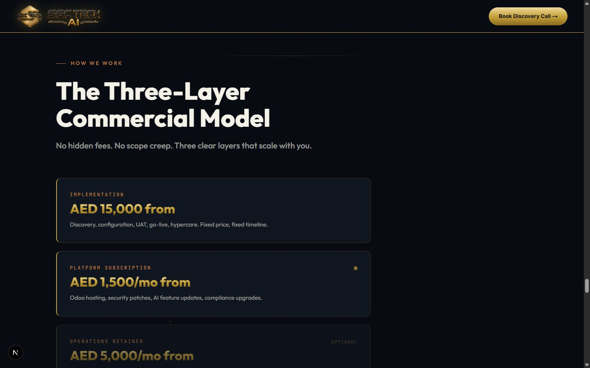

### Current
- `RevealOnScroll` on text blocks.
- `LivingCard` on each phase card.
- Static layout, no sequential animation between phases.

### Suggestion — Phase timeline line draw-in
A connecting timeline line between the three phases (Audit → Implement → Maintain) draws left-to-right via SVG stroke-dashoffset over 800ms as the section enters. Each phase card pops in sequentially once the line reaches it: scale 0.92→1.0 + opacity 0→1, 200ms each. The process feels like a path with a destination, not a menu.

```
Tool: SVG line stroke-dashoffset animation (CSS @keyframes or GSAP)
      Phase cards: motion/react stagger, triggered after line animation completes (delay offset)
```

---

## 12. Pricing Section


### Current
- `TierCard` components per pricing tier.
- `RevealOnScroll` on section heading.
- `LivingCard` hover effects on cards.
- `GoldDrawIn` accent.

### Suggestion — Recommended tier spotlight pulse
When the recommended tier enters the viewport, it pulses once: scale 1.0→1.03→1.0, gold border glow 0→1→0, over 600ms. Simultaneously, other tiers dim (opacity 1→0.75→1). This is a one-shot gesture — not a loop — so it respects focus. Like an advisor quietly tapping the right option.

```
Tool: motion/react — whileInView, once:true
      Recommended: scale keyframes [1, 1.03, 1], boxShadow pulse
      Others: opacity keyframes [1, 0.75, 1]
```

---

## 13. Section Eight — Rescue Audit Letter

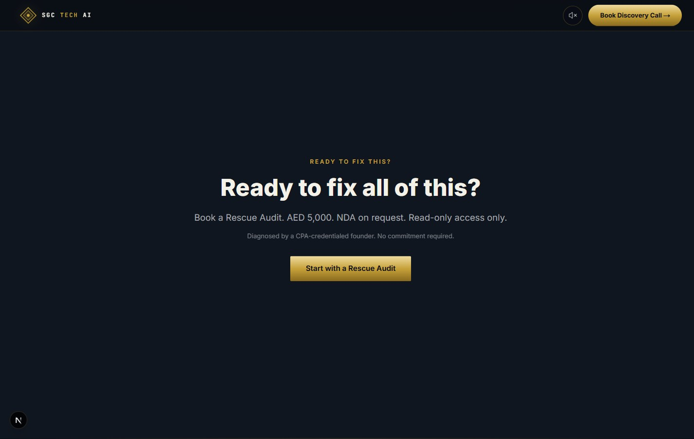

### Current
- Five letter paragraphs animate sequentially: opacity 0→1, y 12→0, stagger 0.14s via Motion `whileInView`.
- Gold left-border with dateline "DUBAI, 2026" fading in first.
- `ProximityCtaButton` at bottom.

### Suggestion — Dateline typewriter + ink-reveal on paragraphs
The dateline "DUBAI, 2026" should type in character-by-character (35ms/char) to set the scene like opening a physical letter. Each paragraph then fades in with a text-gradient wipe sweeping left-to-right (600ms) rather than a plain opacity fade — the feel of ink drying on a page. This is the most personal section; the animation should feel like correspondence, not a slideshow.

```
Tool: motion/react — dateline: same typewriter pattern as FinaleTitle (visibleChars state)
      Paragraphs: background-clip text + gradient sweep via CSS animation or motion custom value
```

---

## 14. Contact Section

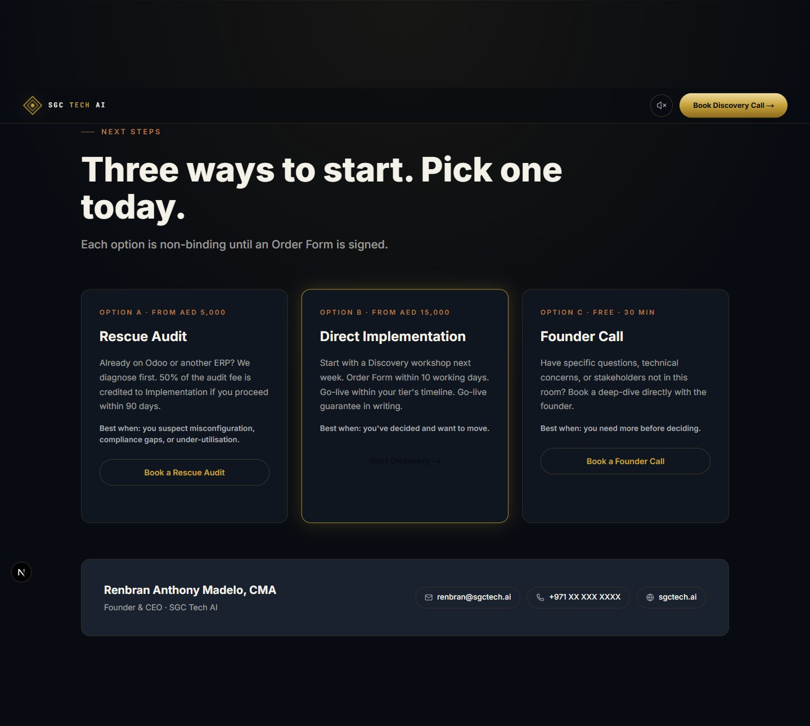

### Current
- Contact form with standard fields.
- `RevealOnScroll` on heading.
- `GoldDrawIn` accent.
- Form fields render statically.

### Suggestion — Field stagger in + gold hairline on focus
Each form field slides in from x -16→0, opacity 0→1, staggered 60ms apart as the section enters. On field focus, a 1px gold underline draws left-to-right (SVG or `::after` pseudo-element, 200ms ease-out) — extending the `<GoldHairline>` pattern already established sitewide into form UX.

```
Tool: motion/react — fields: staggerChildren 0.06, x -16→0
      Focus hairline: onFocus triggers CSS transition on ::after width 0→100%
      (extend existing GoldHairline component to support input mode)
```

---

## 15. Footer

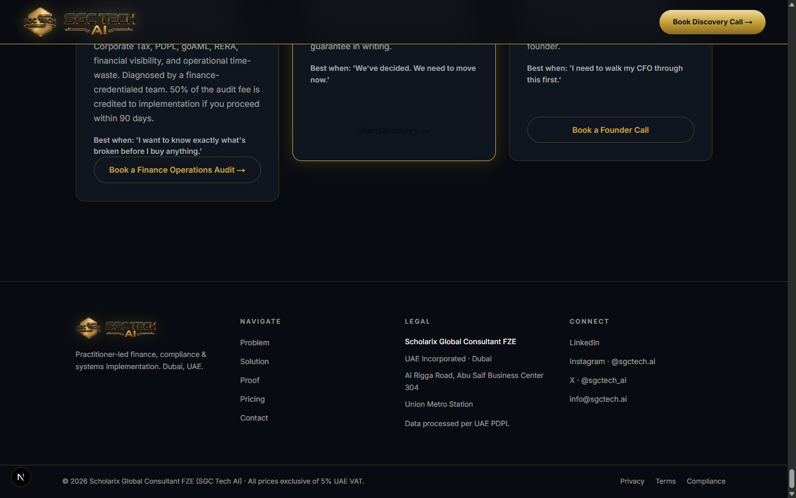

### Current
- Static: logo, nav columns, legal text.
- No entrance animation.
- Gold accent on link hover.

### Suggestion — Column fade-up on page-bottom approach
When the user scrolls within range of the footer (IntersectionObserver, `amount: 0.1`), stagger footer columns: opacity 0→1, y 12→0, 80ms gap. A quiet, dignified close — the footer shouldn't announce itself like a hero, but total silence feels unfinished. The subtle entrance signals "you've arrived."

```
Tool: motion/react — whileInView, amount: 0.1 (fires when footer just peeks)
      staggerChildren: 0.08, y: 12→0
```

---

## Animation Narrative Arc

The full scroll journey should feel like a **practitioner's briefing**:

| Phase | Sections | Tone |
|---|---|---|
| Establish authority | Navbar, CredentialRow, Hero | Measured, confident reveal |
| State the problem | Problem Section | Data accumulates — visceral |
| Show the diagnosis | Shield Section | Mechanical precision, each tile a proof point |
| Present the solution | Solution, Case Study | Architecture builds upward, results land hard |
| Introduce the team | Founder | Personal, credential-forward, human |
| Commercial clarity | Commercial Model, Pricing | Clean sequence, one recommendation spotlit |
| Invitation | Section Eight, Contact | Letter cadence — personal, unhurried |
| Close | Footer | Quiet, dignified, complete |

---

## Implementation Priority

Ordered by storytelling impact vs. implementation cost:

| # | Section | Suggestion | Effort |
|---|---|---|---|
| 1 | Problem Section | Cost counter roll-up | Low |
| 2 | Solution Section | Stack layer build-up | Low |
| 3 | Section Eight | Dateline typewriter | Low |
| 4 | Pricing | Recommended tier pulse | Low |
| 5 | Case Study | Result numbers count up | Low |
| 6 | Contact | Field stagger + gold hairline focus | Low |
| 7 | Founder | Photo clip reveal + credential cascade | Low |
| 8 | CredentialRow | Trust cascade on load | Low |
| 9 | Footer | Column fade-up | Low |
| 10 | Shield Finale | Cards converge into shield | Medium |
| 11 | Commercial Model | Phase timeline draw-in | Medium |
| 12 | Shield Mid | Frame glow intensify | Medium |
| 13 | Hero | Camera breath idle | Medium |
| 14 | Hero captions | Word-by-word reveal | Low |
| 15 | Shield tiles | Lock micro-shake | Medium |
